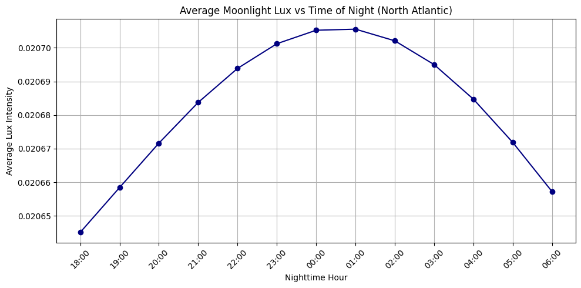
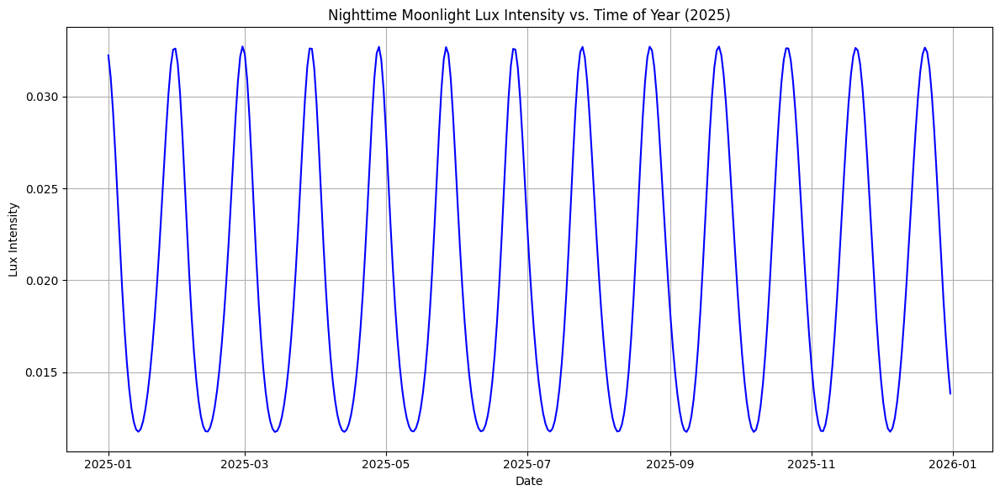
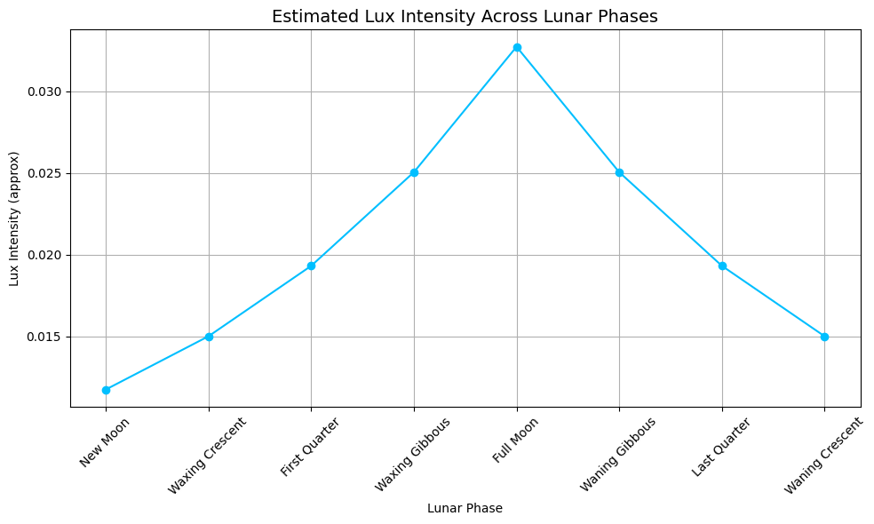

# Airbus-Project

## Optical Observations Of Sea Based Targets Using Lunar Illumination

Steps for the project based on the flowchart created:

Define Location: North Atlantic Ocean

Set time for model at the moment: 12am ( Midnight ) on the 15th April 2025

Define night hours at given location across a year: 

Model lux intensity over the course of the night assuming a full moon: 

Model dark surface:

Define object size: 10m x 5m 

Plot a graph of light intensity at objects at altitude (0km) vs time of night: 

Plot a graph of light intensity of objects at altitude (0km) vs time of year:

Plot a graph of light intensity of objects at altitude (0km) vs lunar phase:

